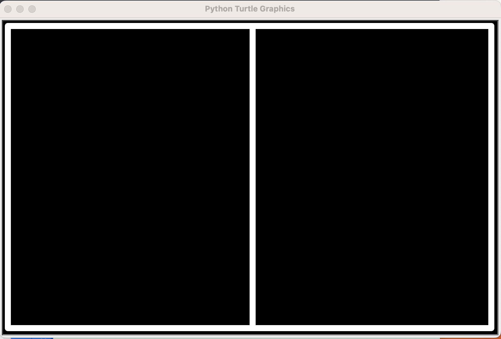

# Pong_Arcade_Game
<a name="readme-top"></a>
# Pong Game

<div align="center">
<!-- Title: -->
<h1><a href="https://github.com/skthati/Pong_Arcade_Game/">Pong Game</a> - Python Turtle </h1>
</div>

<!-- Table of contents -->
<hr>
<hr>
<ol>
    <li><a href="#pong-game">Pong Game</a></li>
    <li><a href="#basics">Basics</a> </li>
</ol>
<hr>
<hr>

<!-- Pong Game -->
## Pong Game <a name="test"></a>
Test Test

1. Code
    ```Python
    sc.onkey(key="Up", fun=up_move)
    sc.onkey(key="Right", fun=right_move)
    sc.onkey(key="Left", fun=left_move)
    sc.onkey(key="Down", fun=down_move)
    ```

2. Output

    

<p align="right">(<a href="#readme-top">back to top</a>)</p>
<hr>  

<!-- Pong Game -->
## Create Pong Board <a name="pong_board"></a>
Create Pong Board.

1. Code
    ```Python
        def pong_board(self):
        t = Turtle()
        t.speed(0)
        t.shape("triangle")
        t.hideturtle()
        t.penup()
        t.goto(-405, 255)
        t.pensize(10)
        t.pendown()
        t.color("white")
        t.begin_fill()

        for i in range(2):
            t.forward(800)
            t.right(90)
            t.forward(500)
            t.right(90)

        t.penup()
        t.goto(0, 250)
        t.pendown()
        t.setheading(270)
        t.forward(490)
    ```

2. Output

    

<p align="right">(<a href="#readme-top">back to top</a>)</p>
<hr>  

<!-- 

Test1  
## Test <a name="test"></a>
Test Test

1. Code
    ```Python
    sc.onkey(key="Up", fun=up_move)
    sc.onkey(key="Right", fun=right_move)
    sc.onkey(key="Left", fun=left_move)
    sc.onkey(key="Down", fun=down_move)
    ```

2. Output

    

<p align="right">(<a href="#readme-top">back to top</a>)</p>
<hr>  


-->

 
